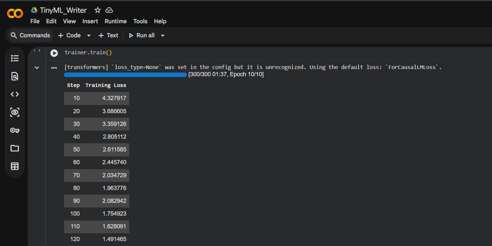

## TinyML Writer: Exploring the Future of Edge AI on Microcontrollers

- Prodigy InfoTech – Generative AI Internship
- Task: 01
## Project Overview

TinyML Writer is a Generative AI project that fine-tunes OpenAI's GPT-2 model to generate future-oriented content about TinyML, Edge AI, and intelligent microcontrollers.
## Objective

Fine-tune GPT-2 on a domain-specific dataset to generate coherent and contextually relevant text about the future of Edge AI on resource-constrained devices.
## Features

- GPT-2 fine-tuning using Hugging Face Transformers
- Custom TinyML dataset
- Future-oriented text generation
- Implemented in Google Colab
## Technologies Used

- Python
- Google Colab
- Hugging Face Transformers
- GPT-2
- PyTorch
- Datasets (Hugging Face)
##  Project Workflow

1. Created a custom TinyML dataset with future-oriented passages.
2. Loaded the GPT-2 tokenizer and pre-trained model.
3. Tokenized the dataset for training.
4. Fine-tuned GPT-2 using Hugging Face Transformers.
5. Generated future-focused text from custom prompts.
6. Evaluated the generated outputs.
## Training Progress

## Results

- Successfully fine-tuned GPT-2 on a custom TinyML dataset.
- Training loss decreased from **4.32** to **0.56** over **10 epochs**.
- Generated coherent, future-oriented text related to TinyML and Edge AI.
## Sample Output

**Prompt:**

> By 2045, TinyML-powered microcontrollers will

**Generated Text:**

> By 2045, TinyML-powered microcontrollers will bring intelligent decision-making to everyday devices. Wearable sensors, smart home systems, and industrial equipment will process data locally, reducing reliance on cloud computing while improving privacy, efficiency, and real-time performance.

  
